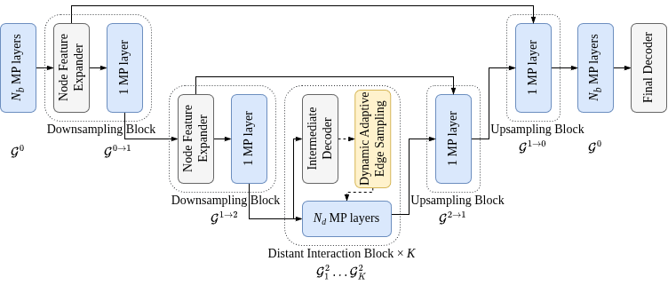

<h2>ScaGNN: a Graph Neural Network for Multiple Scattering Simulations
</h2>


This repository contains the official implementation of the paper [**ScaGNN**]().




## Installation

Clone repository and install libraries in `requirements.txt`. Please refer to [DGL installation page](https://www.dgl.ai/pages/start.html) to install `dgl`.

## Datasets

### Generate datasets
```
sh scripts/gen_laplace_dirichlet.sh
sh scripts/gen_helmholtz_dirichlet.sh
sh scripts/gen_helmholtz_neumann.sh
```

### Download [ScaGNN datasets](https://huggingface.co/datasets/RemiMarsal/pibnet) with [Hugging Face CLI](https://huggingface.co/docs/huggingface_hub/en/guides/cli)
```
hf download RemiMarsal/pibnet --repo-type dataset --local-dir datasets
```

## ScaGNN

### Training

```
sh scripts/train.sh
```

### Testing

```
sh scripts/test.sh
```

## Acknowledgement

We would like to thank the authors of [Multiscale Neural Operators for Solving Time-Independent PDEs](https://openreview.net/forum?id=ihbEbWpaaF) for their great work and for sharing their [code](https://github.com/merantix-momentum/multiscale-pde-operators) and the authors of the [NVIDIA PhysicsNeMo](https://docs.nvidia.com/physicsnemo/latest/physicsnemo/api/models/gnns.html) implementation of [MeshGraphNet](https://arxiv.org/abs/2010.03409).
